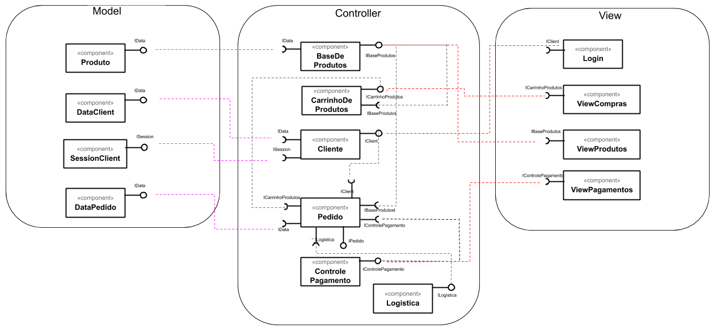
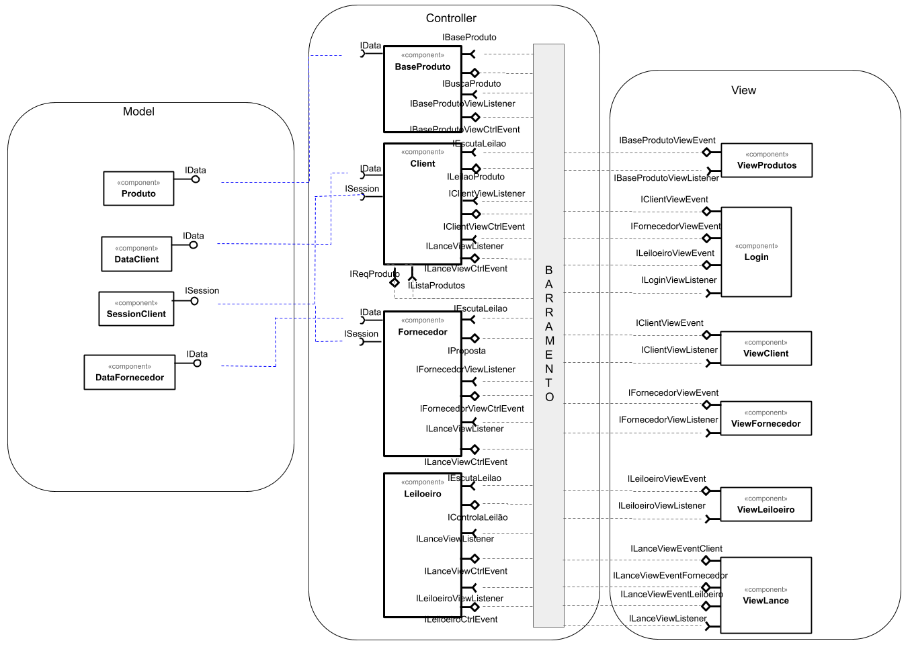

## Lab03 - Model-View-Controller
### Orquestração e Coreografia<br>
</br><b>Equipe 6:</b>
</br>
Agner Esteves Ballejo </br>
Ian Poli Tavares </br>
José Eduardo Porte </br>
Mateus Gonçalves Geracino </br>
Marcos Vinícius Piaia </br>
Tatiany Fermino Rodrigues de Oliveira
<br><br>

## Tarefa 4 - Diagrama de Orquestração
   
<br>

## Tarefa 4 - Diagrama de Coreografia
 </br>

### Troca de mensagens

```html
Login
interface IClientEvent
    tópicos: /view/login/client
    {request login username/pwd}
interface IFornecedorEvent
    tópicos: /view/login/fornecedor
    {request login username/pwd}
interface ILeiloeiroEvent
    tópicos: /view/login/leiloeiro
    {request login username/pwd}
interface ILoginViewListener
    subscribe: /result/view/client
                              /result/view/fornecedor
            /result/view/leiloeiro

ViewProdutos
Interface: IBaseProdutoViewEvent
tópicos: /view/viewprodutos/produto
    {request info product A}
    {request View event A}
Interface: IBaseProductViewListener
subscribe: /result/produto


BaseProduto
Interface: IBaseProduto
    subscribe: /ctrl/produto
Interface IBuscaProduto
    tópico: /result/produto
        {response lista produto [ProductA, ProductB]}
Interface IBaseProdutoViewListener
    subscribe:/view/#/produto
Interface IBaseProdutoCtrlEvent
    tópicos:/result/view/produto
        {response View Product event A}

ViewClient
interface: IClientViewEvent
    tópicos: /view/viewclient/client
{request UI event A}
    {update client xxx data}
interface: IClientViewListener
subscribe: /result/view/client

Cliente:
interface: IEscutaLeilao
    subscribe: /ctrl/leilao
interface: ILeilaoProduto
    tópico: /ctrl/leilao
                        {accept lance number XXXXX}
interface: IClientViewListener
    subscribe: /view/#/client
interface: IClientViewCtrlEvent
    tópicos: /result/view/client
                         {response View Client Event A}
interface: ILanceViewListener
    subscribe: /view/lance/client
interface: ILanceViewCtrlEvent
    tópicos: /result/view/lance/client
                          {response LANCE UI event component B}
interface: IListaProdutos
    subscribe: /result/produto
interface: IReqProdutos
    topicos:/ctrl/produto
                        {request data for product A}

ViewFornecedor
interface: IFornecedorViewEvent
    tópicos: /view/viewfornecedor/fornecedor
{request UI event A}
    {update fornecedor xxx data}
interface: IFornecedorViewListener
subscribe: /result/view/fornecedor


Fornecedor
Interface IEscutaLeilao
    subscribe: /ctrl/leilao
Interface IProposta
    topicos: /ctrl/leilao
    {fornecedor yyyy, client XXXX, product ABC, valor 9999.99}
Interface IFornecedorViewListener
    subscribe: /view/#/fornecedor
Interface IFornecedorViewCtrlEvent
    tópicos: /result/view/fornecedor
    { respons View Fornecedor Event A }
interface: ILanceViewListener
    subscribe: /view/lance/fornecedor
interface: ILanceViewCtrlEvent
    tópicos: /result/view/lance/forncedor
                          {response LANCE UI event component B}

ViewLeiloeiro
interface: ILeiloeiroViewEvent
    tópicos: /view/viewleiloeiro/leiloeiro
{request UI event A}
    {update leiloeiro xxx data}
interface: ILeiloeiroViewListener
subscribe: /result/view/leiloeiro


Leiloeiro
Interface IEscutaLeilao
    subscribe: /ctrl/leilao
Interface IControlaLeilao
    tópicos: /ctrl/leilao
        {client XXX, producto ABC, tempo restante}
        {client XXX, producto ABC, ListaProdutosSelecionados}
Interface ILeiloeiroViewListener
    subscribe: /view/#/leiloeiro
Interface ILeiloeiroViewCtrlEvent
    tópicos: /result/view/leiloeiro
    { respons View Leiloeiro Event A }
interface: ILanceViewListener
    subscribe: /view/lance/leiloeiro
interface: ILanceViewCtrlEvent
    tópicos: /result/view/lance/leiloeiro
                          {response LANCE UI event component B}

ViewLance
interface: ILanceViewEventLeiloeiro
    tópicos: /view/viewlance/leiloeiro
{request UI event LANCE LEILOEIRO A}
interface: ILanceViewEventClient
    tópicos: /view/viewlance/client
{request UI event LANCE CLIENT A}
interface: ILanceViewEventFornecedor
    tópicos: /view/viewlance/fornecedor
{request UI event LANCE FORNECEDOR A}
interface: ILanceViewListener
    tópicos: /result/view/viewlance/#
{response UI event LANCE FORNECEDOR A}
    {response UI event LANCE CLIENT A}
    {response UI event LANCE LEILOEIRO A}
```
